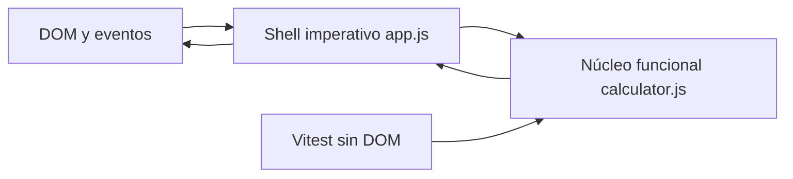
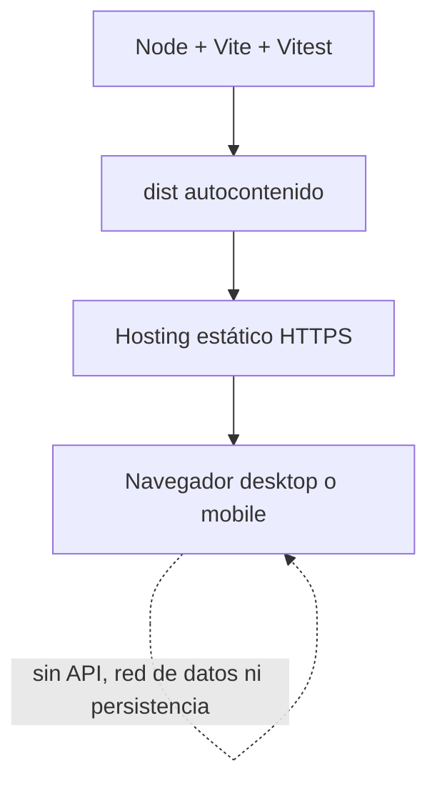

# Architecture Spine - Calculadora de Tope de Reintegro

## Paradigma de diseño

**Núcleo funcional y shell imperativo.** `src/calculator.js` contiene validación, cálculo y formateo puros. `src/app.js` es la única unidad que lee eventos o muta el DOM.



## Invariantes y reglas

### AD-1 - Frontera funcional [ADOPTED]

- **Binds:** todos los requisitos funcionales y NFR-007
- **Prevents:** que validación, cálculo o formateo dependan del DOM y que existan rutas de cálculo incompatibles.
- **Rule:** `calculator.js` no importa APIs del navegador, no conserva estado y no produce efectos. `app.js` puede depender del núcleo; el núcleo nunca puede depender de la shell.

### AD-2 - Aritmética decimal exacta [ADOPTED]

- **Binds:** FR-003..FR-010, FR-014, AC-001, AC-002, AC-004 y AC-012
- **Prevents:** resultados divergentes por coma flotante o el cálculo del máximo seguro desde un valor ya redondeado.
- **Rule:** porcentaje, tope y resultados se representan internamente como enteros `BigInt`: porcentaje en centésimas y dinero en centavos. El cociente y residuo racionales determinan el truncamiento y el redondeo; `Number`, `parseFloat` y coerciones numéricas quedan prohibidos en la aritmética de negocio.

### AD-3 - Contrato único de evaluación

- **Binds:** FR-003..FR-012 y NFR-007
- **Prevents:** validadores distintos por campo o resultados parciales con contratos de error incompatibles.
- **Rule:** `calculator.js` expone los named exports `evaluateCalculation({ discountRaw, capRaw })` y `formatArs(cents)`. Evaluar devuelve `{ ok: false, errors: { discount, cap } }`, con ambas claves siempre presentes y `null` como único sentinel sin error, o `{ ok: true, result: { theoreticalCents, safeCents } }`. Los códigos cerrados son `required`, `incomplete`, `too-many-decimals`, `invalid-format` y `out-of-range`, en esa precedencia. La shell los traduce a microcopy.

### AD-4 - Gramática de entrada antes de conversión

- **Binds:** FR-003..FR-006a y AC-002..AC-005
- **Prevents:** que el navegador acepte notación científica, signos, separadores de miles o formatos diferentes según plataforma.
- **Rule:** ambos controles son `type="text"` con `inputmode="decimal"`. Se clasifica en orden y sin solapamiento: `''` es `required`; `^\d+[.,]$` es `incomplete`; `^\d+[.,]\d{3,}$` es `too-many-decimals`; `^\d+(?:[.,]\d{1,2})?$` es válido; el resto es `invalid-format`. No se recorta whitespace y se permiten ceros iniciales. Solo después se crean `BigInt` y los valores fuera de límites producen `out-of-range`.

### AD-5 - Estado efímero y render atómico

- **Binds:** FR-006, FR-011, FR-012, NFR-004 y NFR-005
- **Prevents:** estado duplicado, resultados obsoletos o persistencia accidental.
- **Rule:** el DOM posee los strings y la shell posee `touched = { discount, cap }`, inicialmente falso por campo. `input` marca solo su campo pero siempre invoca `evaluateCalculation` con ambos strings; `blur` marca su campo y vuelve a renderizar. El otro campo no muestra error hasta su propio evento. Todo error del campo tocado se muestra, salvo `incomplete` mientras conserva foco. El render síncrono muta nodos existentes sin reemplazar el subárbol interactivo; toda invalidez oculta ambos resultados. Limpiar restablece ambos flags. No se usan cookies, Web Storage, IndexedDB ni red.

### AD-6 - Responsive mobile-first [ADOPTED]

- **Binds:** FR-013, FR-020, NFR-001..NFR-003, NFR-006, AC-007, AC-008, AC-011 y AC-014
- **Prevents:** que componentes implementados por separado solo funcionen en el mockup desktop o introduzcan overflow horizontal.
- **Rule:** `index.html` declara `<meta name="viewport" content="width=device-width, initial-scale=1">`. La base CSS funciona desde `320px`: la página aporta `padding-inline: 16px`, el contenedor interno usa `width: 100%` y `max-width: 640px`, y los controles miden al menos `44px`. Resultados apilados pasan únicamente en `@media (min-width: 640px)` a dos columnas iguales con `minmax(0, 1fr)`. Tarjetas y celdas usan `min-width: 0`; valores usan `font-size: clamp(1.25rem, 7vw, 2rem)` y `overflow-wrap: anywhere` como último recurso. El importe máximo debe renderizar sin overflow; queda prohibido ocultar defectos con `overflow-x: hidden`.

### AD-7 - Semántica accesible en todos los estados [ADOPTED]

- **Binds:** FR-001, FR-002, FR-006, FR-013, FR-015, FR-019, NFR-003 y AC-008
- **Prevents:** variantes visualmente correctas pero inoperables con teclado o lector de pantalla.
- **Rule:** cada input tiene `label` asociado y errores enlazados con `aria-describedby`; el foco es visible; visibilidad real usa `hidden`; resultados y recomendación se identifican con texto. `#calculator-status` es persistente, con `role="status"`, `aria-live="polite"` y `aria-atomic="true"`: queda vacío al iniciar, limpiar o no haber error visible; concatena errores visibles; y en válido anuncia ambos importes formateados. El orden DOM es porcentaje, tope, Limpiar, resultado teórico y resultado seguro, sin reordenamiento CSS. La advertencia usa `details/summary` y su `summary` visible contiene los tres avisos de FR-019.

### AD-8 - Runtime autocontenido y despliegue estático

- **Binds:** NFR-004..NFR-006 y AC-009..AC-011
- **Prevents:** llamadas externas, fallos por CDN o configuraciones diferentes entre ambientes.
- **Rule:** Vite usa `base: './'`; CSS importa fuentes desde `src/assets/` para que el grafo de build emita rutas relativas. `dist/` contiene todo el runtime y funciona en raíz o subruta; el adaptador del hosting prueba la URL real. No hay dependencias de producción, API, analytics, recursos remotos, lógica de servidor ni variables de ambiente; el proveedor debe servirlo por HTTPS.

### AD-9 - Puertas de compatibilidad y calidad

- **Binds:** NFR-001..NFR-004, NFR-006, NFR-007 y AC-001..AC-014
- **Prevents:** builds que pasan localmente pero cambian la aritmética o fallan en navegadores y anchos comprometidos.
- **Rule:** una máquina limpia ejecuta `npm ci` y `npx playwright install --with-deps chromium firefox webkit` antes de las puertas; test y build fallan si descubren cero pruebas. `test:browser` construye y Playwright posee `webServer: npm run preview -- --host 127.0.0.1 --port 4173 --strictPort` y `baseURL: http://127.0.0.1:4173`. Vitest cubre el núcleo; Playwright cubre interacción y responsive en motores bundled y canales Chrome/Edge disponibles. Vite fija `chrome120`, `edge120`, `firefox120`, `safari17` e `ios17`. Evidencia separada certifica NFR-006; WebKit no se presenta como Safari. La medición p95 va desde entrada al listener hasta completar mutaciones DOM síncronas, con diez muestras y nearest-rank `ceil(0.95*n)-1`.

### AD-10 - Operación mínima del artefacto

- **Binds:** despliegue y operación del MVP
- **Prevents:** releases imposibles de identificar o revertir y políticas de cache que dejan HTML obsoleto.
- **Rule:** `npm run build` genera `dist/version.json` con `commit`, `dirty` y `sourceDigest`; el digest SHA-256 cubre, ordenados por ruta y bytes, `index.html`, `src/**`, `package*.json`, `vite.config.js` y `scripts/write-version.js`. Rollback referencia el digest de un `dist/` previo. El adaptador de hosting posee headers, HTTPS, disponibilidad, logs sin valores de formulario y smoke de carga/cálculo. No existe telemetría cliente.

## Convenciones de consistencia

| Área | Convención |
| --- | --- |
| Archivos y símbolos | Archivos JavaScript en `kebab-case`; funciones y variables en `camelCase`; constantes en `UPPER_SNAKE_CASE`. |
| Dinero | Sufijo `Cents`; siempre `BigInt`; el formateador puro produce `$` + miles con punto + dos decimales con coma. |
| Porcentaje | Sufijo `Hundredths`; `15,50%` se representa como `1550n`. |
| Errores | Códigos de dominio estables en inglés; texto visible en español neutro solo en la shell. |
| CSS | Tokens aprobados como custom properties; `box-sizing: border-box` global; mobile-first; sin estilos inline ni dimensiones de viewport rígidas. |
| Activos | Nunito en WOFF2 local con licencia incluida; `system-ui` permanece como fallback; ningún CDN. |
| Tokens adjudicados | `result-label` sin `letter-spacing`; botón Limpiar con radio de `8px`; estas reglas prevalecen sobre los valores contradictorios del frontmatter de DESIGN. |
| Hooks DOM | `#discount` y `#cap` son inputs; `#*-error` son nodos de mensaje; `#clear` es botón; `#results` es grid/sección con `hidden`; `#*-result` son nodos de valor; `#calculator-status` es status; `#disclaimer` es `details`. |
| Hooks CSS | `.page`, `.calculator`, `.results`, `.result-card`, `.result-value`, `.formula` y `.example`; HTML publica estas clases y CSS no depende de estructura implícita. |
| Scripts de calidad | `dev`, `test`, `test:browser`, `build` y `preview`; el test browser se llama `tests/calculator.browser.spec.js`. |
| Dependencias | npm `11.16.0`, `package-lock.json` versionado y `npm ci` como única instalación de entrega/CI. |
| Grafo de entrada | `index.html` carga solo `/src/app.js` como módulo; `app.js` importa `./styles.css`; `styles.css` importa `./assets/nunito-latin.woff2`. |

## Stack

| Nombre | Versión |
| --- | --- |
| Node.js Active LTS | 24.18.0 |
| npm | 11.16.0 |
| Vite | 8.1.5 |
| Vitest | 4.1.10 |
| Playwright Test | 1.62.0 |
| Chrome / Edge / Firefox / Safari | 120+ / 120+ / 120+ / 17+ |

Sin framework UI ni dependencias JavaScript de runtime.

## Semilla estructural

```text
Calculadora/
  index.html                 # Documento semántico y única superficie
  src/
    app.js                   # Shell: eventos, estado efímero y render DOM
    calculator.js            # Núcleo puro: validar, calcular y formatear
    styles.css               # Tokens, componentes y reglas responsive
  tests/
    calculator.test.js              # Contrato del núcleo sin DOM
    calculator.browser.spec.js      # Interacción y responsive en navegador
  src/assets/
    nunito-latin.woff2               # Fuente variable normal 400..800
  licenses/
    OFL-Nunito.txt                   # Licencia de la fuente
  scripts/
    write-version.js                 # Emite dist/version.json desde Git
  vite.config.js             # Targets explícitos de compatibilidad
  playwright.config.js       # Matriz browser y viewports comprometidos
  package.json               # Scripts dev, test, build y preview
  package-lock.json          # Resolución reproducible de dependencias
```



## Mapa capacidad-arquitectura

| Capacidad / área | Vive en | Gobernada por |
| --- | --- | --- |
| Entrada y validación, FR-001..FR-006a | `index.html`, `calculator.js`, `app.js` | AD-1, AD-3, AD-4, AD-7 |
| Cálculo exacto, FR-007..FR-012 | `calculator.js` | AD-1, AD-2, AD-3 |
| Resultados y explicación, FR-013..FR-019 | `index.html`, `app.js` | AD-5, AD-7 |
| Sistema visual, FR-020 | `styles.css` | AD-6 y convenciones CSS |
| Privacidad y rendimiento, NFR-004..NFR-005 | núcleo local y `dist/` | AD-5, AD-8, AD-9 |
| Compatibilidad y mantenibilidad, NFR-006..NFR-007 | Vite, Vitest y `tests/` | AD-1, AD-9 |
| Responsive y accesibilidad, NFR-001..NFR-003 | `index.html`, `styles.css` y pruebas browser | AD-6, AD-7, AD-9 |

## Diferido

- **Proveedor de hosting y CI:** decidir cuando exista un destino de publicación; `dist/` es deliberadamente independiente del proveedor.
- **Servicio de browsers reales:** elegir antes de certificar NFR-006 si la matriz mínima no está disponible localmente; la evidencia exigida por AD-9 no se difiere.
- **Regresión visual por píxeles:** incorporar cuando el diseño tenga variantes suficientes para que las aserciones estructurales de Playwright dejen de detectar regresiones relevantes.
- **Subdivisión adicional de módulos o CSS:** aplicar la regla de tres; la semilla actual solo se divide cuando aparezcan tres responsabilidades repetidas o una frontera que requiera aislamiento propio.
